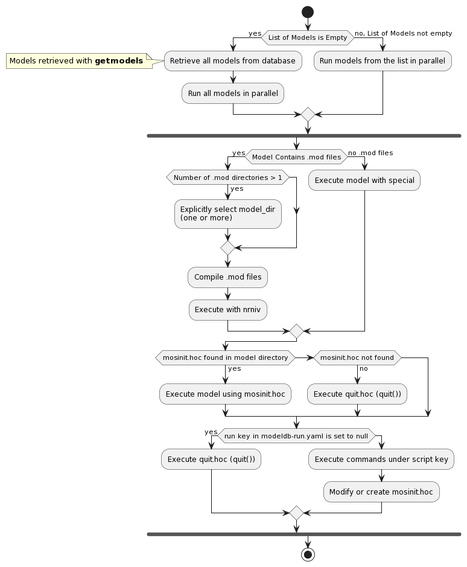

# nrn-modeldb-ci

## Installation

In your virtual environment, install in editable mode: 

```
pip install -e .
```

NOTE: You have to install NEURON by yourself (wheel, CMake install).

### Working with a local build of NEURON
When debugging unexpected failures in the ModelDB CI with a new NEURON change,
it can be useful to run from the build directory of a local CMake build of NEURON.

To achieve this, create a virtual environment with an editable installation of nrn-modeldb-ci, as above.
Then, set the following environment variables to point at your CMake build directory for NEURON:
```bash
. my_virtual_environment/bin/activate
export NRNHOME=/path/to/your/nrn/build_dir
export NEURONHOME=${NRNHOME}/share/nrn
export PATH=${NRNHOME}/bin:${PATH}
export PYTHONPATH=${NRNHOME}/lib/python:${PYTHONPATH}
```

## Usage

The following commands are now available:

* `getmodels` -> retrieve all or specified models from ModelDB.
  ```
  getmodels -h
  ```

  
* `runmodels` -> run `nrn-modeldb-ci` for all or specified models.
  ```
  runmodels -h
  ```
  Note that models have to be downloaded beforehand with `getmodels`.
  You can specify `--virtual` so that NEURON GUI is run in headless mode. It requires a backend (n.r. `Xvfb`).
  Re-running in the same `--workdir` can mangle results. Please use `--clean` if you wish to re-run in the same `--workdir`.
  

* `report2html` -> create an interactive HTML report for a given json report (obtained with `runmodels`)
  ```
  report2html -h
  ```
  Note that the generated HTML file is self-contained.


* `diffgout` -> launch `nrngui` and display the two gout files in different colors.
  ```
  diffgout -h
  ```
  This can come in handy when comparing/investigating results from binary incompatible neuron versions. 


* `diffreports2html` -> create an interactive `NEURONv1-vs-NEURONv2` HTML report 
  ```
  diffreports2html -h
  ```
  The differences that are taken into account:
  * `nrn_run` and `moderr` from the json reports -> outputs side-by-side diffs
  * `gout` -> outputs git-like diffs; **NOTE**: this walks gout paths from json report `run_info`, make sure they are present.
  
  Note that the generated HTML file is self-contained.
  

* `compare_gout_files` -> list all gout paths that differ between two folders.
  ```
  compare_gout_files -h
  ```
  Does not require a ```--gout``` arg to ```runmodels```.


* `show_diff_gout` -> like `compare_gout_files` but also does diffgout for each.
  ```
  show_diff_gout -h
  ```

* `modeldb-config` -> list configuration for `nrn-modeldb-ci`:
  ```
    modeldb-config
  ```
    
  | Config                  | Details                                                                     |
  | ---                     | ----                                                                        |
  | ROOT_DIR                | location of `nrn-modeldb-ci` installation                                   |
  | MODELDB_ROOT_DIR        | path to `modeldb` package inside `nrn-modeldb-ci`                           |
  | MODELDB_RUN_FILE        | yaml file containing run instructions for models (required for `runmodels`) |
  | MODELDB_METADATA_FILE   | yaml file containing model info for those downloaded with `getmodels`       |
  | MODELS_ZIP_DIR          | location of cache folder for models populated via `getmodels`               |
  | MDB_NEURON_MODELS_URL   | url template used to get NEURON model IDs and last-updated timestamps (needed for `getmodels`) |
  | MDB_MODEL_METADATA_URL  | url template used to get metadata about a single NEURON model (needed for `getmodels`) |
  | MDB_MODEL_DOWNLOAD_URL  | url template used for model downloading (cf `{model_id}`)                   |

## Model Run

### MODELDB_RUN_FILE 

This is where the "black magic" lives, instructions on how to run models from ModelDB. 
Default handling is available in case there are no entries for a given model id. 

All entries are optional:

| yaml entry | special value   | Details                                                       | Default handling       |
| ---        | ---             | ----                                                          | ---                    |
| run        |                 | custom instructions used to effectively run the model         | `verify_graph_()`     *|
| run        | null            | `DoNotRun` mode -> model is built but not run                 ||
| model_dir  |                 | custom location of `mod` sub-directory to compile             | `*.mod` @ root level   |
| model_dir  | dir;dir         | several custom `mod` sub-directories to compile               | `*.mod` @ root level   |
| skip       |                 | model is skipped from running alltogether                     ||
| comment    |                 | comment to be included in the report for `skip` or `run: null`||
| script     |                 | bash script entries needed to adjust the model before running ||

(*) `verify_graph_()` saves all lines of all graphs to the `gout` file in the model working directory.

### Model Run Activity Diagram

When launching `runmodels` the following happens: 



See model configuration section for details on how to configure the model run.

### Report

The generated report following `runmodels` contains te following info:

* `gout` - (optional) graph data from the neuron execution (must be run with `runmodels --gout`)
* `logs` - logs regarding model setup, nrnivmodl, ...
* `nrn_run` - command used to run the model and its output
* `run_info` - model run information
* `run_time` - model run time

For example, by running:
```
runmodels --gout --workdir=test3682 3682
```
we will generate report `test3782.json` :
```yaml
{
    "0": {...} # runmodels stats, see next section
    "3682": {
        "gout": [
            "Graphs 1\n",
            "Graph[0]\n",
            "lines 1\n",
            "points 10001\n",
            "xvec1\n",
            "0\n",
            "0.025\n",
            ".....",            # truncated (can be HUGE)
            "-57.9912\n",
            "\n"
        ],
        "logs": [
            "",
            "",
            "/usr/bin/xcrun",
            "%model_dir%",
            "Mod files: \"%model_dir%/hh3.mod\" \"%model_dir%/rglu_score.mod\"",
            "",
            "Creating x86_64 directory for .o files.",
            "",
            "COBJS=''",
            " -> \u001b[32mNMODL\u001b[0m %model_dir%/hh3.mod",
            " -> \u001b[32mCompiling\u001b[0m mod_func.cpp",
            " -> \u001b[32mNMODL\u001b[0m %model_dir%/rglu_score.mod",
            "Translating hh3.mod into %model_dir%/x86_64/hh3.c",
            "Notice: VERBATIM blocks are not thread safe",
            "Translating rglu_score.mod into %model_dir%/x86_64/rglu_score.c",
            "Notice: This mechanism cannot be used with CVODE",
            "Notice: VERBATIM blocks are not thread safe",
            "Notice: Assignment to the GLOBAL variable, \"inf\", is not thread safe",
            "Notice: This mechanism cannot be used with CVODE",
            "Notice: Assignment to the GLOBAL variable, \"Rtau_AMPA\", is not thread safe",
            "Notice: Assignment to the GLOBAL variable, \"Rinf_AMPA\", is not thread safe",
            "Notice: Assignment to the GLOBAL variable, \"Rtau_NMDA\", is not thread safe",
            "Notice: Assignment to the GLOBAL variable, \"Rinf_NMDA\", is not thread safe",
            "Warning: Default 37 of PARAMETER celsius will be ignored and set by NEURON.",
            "Warning: Default -100 of PARAMETER ek will be ignored and set by NEURON.",
            "Warning: Default 40 of PARAMETER ena will be ignored and set by NEURON.",
            " -> \u001b[32mCompiling\u001b[0m hh3.c",
            " -> \u001b[32mCompiling\u001b[0m rglu_score.c",
            " => \u001b[32mLINKING\u001b[0m shared library ./libnrnmech.dylib",
            " => \u001b[32mLINKING\u001b[0m executable ./special LDFLAGS are:   ",
            "Successfully created x86_64/special",
            "INFO : Using neuron-nightly Package (Developer Version)",
            ""
        ],
        "nrn_run": [
            "RUNNING -> ./x86_64/special -nobanner %model_dir%/mosinit.hoc %model_dir%/driver.hoc",
            "\t0 ",
            "\t1 ",
            "\t1 ",
            "\t1 ",
            "\t1 ",
            "\t1 ",
            "\t1 ",
            "\t1 ",
            "\t1 ",
            "\t1 ",
            "\t1 ",
            "Spike at 40.5 ",
            "Spike at 81.15 ",
            "Spike at 108 ",
            "Spike at 133.65 ",
            "Spike at 180.775 ",
            "Spike at 201.3 ",
            "Total spikes: 6 ",
            "\t1 ",
            "\t1 ",
            ""
        ],
        "run_info": {
            "driver": "/Users/savulesc/Workspace/nrn-modeldb-ci/test3682/synmap/driver.hoc",
            "init": "/Users/savulesc/Workspace/nrn-modeldb-ci/test3682/synmap/mosinit.hoc",
            "model_dir": "/Users/savulesc/Workspace/nrn-modeldb-ci/test3682/synmap",
            "script": [
                "echo 'use_mcell_ran4(1)' > temp",
                "cat mosinit.hoc >> temp",
                "mv temp  mosinit.hoc"
            ],
            "start_dir": "/Users/savulesc/Workspace/nrn-modeldb-ci/test3682/synmap"
        },
        "run_time": "7.595794515"
    }
}
```

Every `runmodels` report will hold out run statistics in the `"0"` key: 
```yaml
    "0": {
        "NEURON version": "8.0a-743-g3871f82a",
        "Stats": {
            "Failed models": {
                "Accession numbers": [
                    20212,
                    97868,
                    144549,
                    186768,
                    244262
                ],
                "Count": 5
            },
            "Failed runs": {
                "Accession numbers": [
                    194897
                ],
                "Count": 1
            },
            "No. of models run": 659
        }
    },
```

For every model there is a `<model.id>.yaml` that is dumped in the model run directory.
This is used in case the model is re-run in `--inplace` mode (also useful for debugging). 

```bash
(venv) nrn-modeldb-ci$ cat test3682/synmap/3682.yaml
```
```yaml
driver: /home/savulesc/Workspace/nrn-modeldb-ci/test3682/synmap/driver.hoc
init: /home/savulesc/Workspace/nrn-modeldb-ci/test3682/synmap/mosinit.hoc
model_dir: /home/savulesc/Workspace/nrn-modeldb-ci/test3682/synmap
script:
- echo 'use_mcell_ran4(1)' > temp
- cat mosinit.hoc >> temp
- mv temp  mosinit.hoc
start_dir: /home/savulesc/Workspace/nrn-modeldb-ci/test3682/synmap
(venv) savulesc@bbd-cjngk03:~/Workspace/nrn-modeldb-ci$ 
```

## New models, model curation and future work
If an explicit list of model IDs is not passed then `nrn-modeldb-ci` runs all available models from the ModelDB website that are tagged as using the NEURON simulator: https://modeldb.science/modellist/1882.

This implies that new models being added can cause runs of `nrn-modeldb-ci`, as the workflow for adding new models to the database does not currently include a check that `nrn-modeldb-ci` succeeds and gives the same results with the latest release of NEURON and the latest development (`neuron-nightly`).

It is best to pay attention to the automatic notifications from the scheduled nightly run of `nrn-modeldb-ci`, as this maximimises the chance that a broken new model can be fixed while it is still a recent addition in some meaningful sense.

## Testing changes to model run parameters with pull requests
By default, only certain models are tested when submitting a pull request.
This can be overridden by adding `MODELS_TO_RUN=[MODELS]` anywhere to the description of the pull request, where `[MODELS]` is a space-separated list of model IDs (without any quotation marks).

### Sources of truth
The https://modeldb.science/ website is the authoritative source of models.
Most models are also present on GitHub under the ModelDBRepository organisation, but new models are not always added there promptly, and there have historically been some differences and inconsistencies [#71](https://github.com/neuronsimulator/nrn-modeldb-ci/issues/71).
Fixes and updates to the models are made via GitHub pull request, but the first step should be to verify that the GitHub repository is in sync with the website version.
By default, `getmodels` will fetch from the website.
This can be steered from `modeldb-run.yaml` using a special `github:` key; the most useful value for this is something like `"pull/42"`, which checks out the feature branch associated with pull request #42 to ModelDBRepository/{model_id} on GitHub (`"default"` fetches the default branch from ModelDBRepository/{model_id}, while `"/myname"` fetches the default branch from `myname/{model_id}` -- the latter option is useful for models that have not yet been synced to GitHub under the ModelDBRepository organisation).

### Model configuration
Sufficiently simple models that follow the (implicit?) `mosinit.hoc` convention should work without configuration.

Regarding custom mechanisms (MOD files), the logic is as follows:
- If the model contains no `.mod` files, it will simply be executed with `nrniv`
- If the model contains exactly one directory of `.mod` files, they will be compiled and it will be executed with the resulting `special` executable
- If the model contains more than one directory of `.mod` files, explicit selection of one of them via the `model_dir` key in `modeldb-run.yaml` is required.

The model will be executed using the most shallowly nested `mosinit.hoc` file found within the model directory.
If no `mosinit.hoc` is found, a trivial `quit.hoc` (containing `quit()`) is used instead; this is also used if the `run` key in `modeldb-run.yaml` is explicitly set to `null`.
The commands under the `script` key in `modeldb-run.yaml` are executed before this search, so they can be used to modify or create `mosinit.hoc` and, therefore, modify how the model is executed.
These commands are sometimes also used to apply CI-specific fixes to the models, for example ensuring that consistent random number seeds are used.

Some entries in ModelDB contain multiple models, *i.e.* different (potentially incompatible) sets of MOD files and different launch scripts.
There is currently no meaningful way of handling this in the general case; just choose one to try and execute.
Sometimes it's possible to use the `run` key to execute multiple scripts sequentially from one HOC script, but this is fragile and does not always work.

### Model output curation
Some models print data to the standard output and error streams that should not be included in the comparison.
Examples include models that print the current date or time, or models that print noisy values such as execution times.
The `curate_patterns` key can be used to specify a list of regular expressions that are applied to the output before it
is diffed.

### Skipped models
Due to limited person-power and historical factors, not all available models are compiled + executed.
There are two types of model skipping:
- `run: null`: MOD files are compiled, but `special` is just called with a trivial `quit.hoc`.
- `skip: true`: MOD files are not compiled.

In principle this should never be needed, and all instances of `run: null` and `skip: true` should be fixed.


## Creating a new PyPI release

In order to create a new release and publish it to PyPi, a new GitHub release together with a new tag on master must be published.
Please refer to the official documentation: https://docs.github.com/en/repositories/releasing-projects-on-github/managing-releases-in-a-repository 

[python-publish.yaml GitHub workflow](.github/workflows/nrn-modeldb-ci.yaml) is used to automate the process of uploading a Python package to the Python Package Index (PyPI). The workflow is triggered by the release event (with the published type). Using the ``build`` package, it creates a source distribution and a wheel distribution of the package. The final step is to publish the package to PyPI using the ``pypa/gh-action-pypi-publish`` action. 


## Funding


`nrn-modeldb-ci` is developed in a joint collaboration between the Blue Brain Project and Yale University. This work is supported by funding to the Blue Brain Project, a research center of the École polytechnique fédérale de Lausanne (EPFL), from the Swiss government’s ETH Board of the Swiss Federal Institutes of Technology, NIH grant number R01NS11613 (Yale University), the European Union Seventh Framework Program (FP7/20072013) under grant agreement n◦ 604102 (HBP) and the European Union’s Horizon 2020 Framework Programme for Research and Innovation under Specific Grant Agreement n◦ 720270 (Human Brain Project SGA1), n◦ 785907 (Human Brain Project SGA2) and n◦ 945539 (Human Brain Project SGA3).

Copyright (c) 2022 Yale University & Blue Brain Project/EPFL
